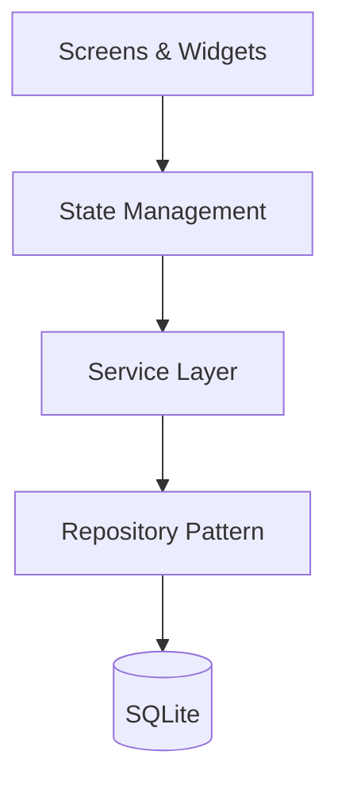
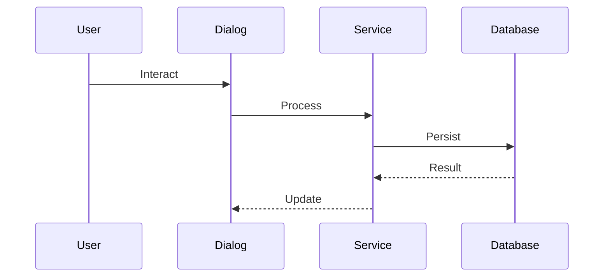
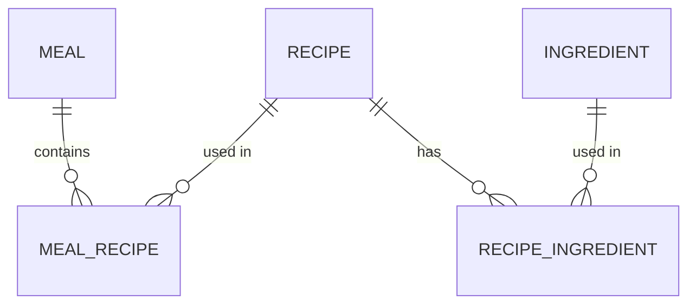

# Documentation Master Agent Skill

## Overview

This skill maintains project documentation quality through systematic checkpoint-driven processes. It acts as a technical writer who audits existing documentation, identifies gaps, updates content after code changes, creates missing documentation, and enforces consistency standards across the entire project.

**Core philosophy:** Documentation is a maintained asset, not an afterthought. Every code change should have corresponding documentation updates, and all documentation should be organized, discoverable, and accurate.

## When to Use This Skill

**Trigger phrases:**
- "Update documentation for #XXX"
- "Audit project documentation"
- "Improve the README"
- "Document the [feature/component]"
- "Create architecture documentation"
- "Fix documentation gaps"
- "Organize the docs folder"
- "Update code comments for [file]"
- "Create developer guide"
- "Write an ADR for [decision]"
- "Check documentation quality"

**Use cases:**

1. **Post-Implementation Documentation** - Update docs after completing a feature or fix
2. **Documentation Audit** - Review all documentation for gaps and outdated content
3. **Specific Documentation Task** - Create architecture doc, developer guide, or pattern doc
4. **Architecture Decision Records** - Document significant technical decisions
5. **Code Documentation** - Add/improve dartdoc comments in source files
6. **Gap Analysis** - Find undocumented features or inconsistencies

## The Documentation Master Role

**What this skill provides:**

A Technical Writer perspective that:
- Audits existing documentation for gaps and accuracy
- Organizes documentation structure logically
- Updates documentation after code changes
- Creates new documentation when needed
- Maintains consistency across all docs
- Improves clarity and readability
- Creates examples and code snippets
- Generates architecture diagrams (Mermaid)
- Ensures documentation is discoverable
- Documents significant decisions (ADRs)

**Gastrobrain-specific requirements:**
- Follow project conventions (CLAUDE.md, workflows)
- Consider localization (EN/PT-BR) for user-facing docs
- Reference architecture patterns (ServiceProvider, DatabaseHelper)
- Align with testing documentation (testing guides)
- Use Git Flow workflow conventions in examples

## Documentation Types

| Type | Location | Purpose |
|------|----------|---------|
| Project Overview | `README.md` | First impression, quick start |
| Architecture | `docs/architecture/` | System design, data models |
| Workflow Guides | `docs/workflows/` | Development processes |
| Testing Guides | `docs/testing/` | Test patterns and helpers |
| Planning | `docs/planning/` | Milestones, roadmaps |
| Feature Guides | `docs/guides/` | Individual feature docs |
| Pattern Docs | `docs/patterns/` | Reusable design patterns |
| Decision Records | `docs/decisions/` | ADRs for key decisions |
| Code Comments | `lib/` | Dartdoc in source files |
| Skill Docs | `.claude/skills/` | Agent skill documentation |

---

## Process A: Full Documentation Audit (6 Checkpoints)

**Use when:** Performing a comprehensive review of all project documentation.

### Checkpoint Flow Overview

```
Trigger: "Audit project documentation"
    |
Checkpoint 1: Inventory Existing Documentation (WAIT)
    |
Checkpoint 2: Gap Analysis (WAIT)
    |
Checkpoint 3: Structure Assessment (WAIT)
    |
Checkpoint 4: Quality Review (WAIT)
    |
Checkpoint 5: Improvement Plan (WAIT)
    |
Checkpoint 6: Execute Priority Updates (WAIT)
    |
Documentation Audit Complete
```

---

### Checkpoint 1: Inventory Existing Documentation

**Purpose:** Catalog all documentation files and assess their current state.

**Actions:**
1. Scan all documentation locations (docs/, README.md, lib/, .claude/skills/)
2. List every documentation file found
3. Categorize by type (architecture, guide, workflow, testing, planning)
4. Note last modified dates
5. Assess completeness (complete, partial, stub, outdated)

**Output format:**
```
Documentation Audit

CHECKPOINT 1: Inventory Existing Documentation
───────────────────────────────────────────────

Scanning documentation locations...

📂 Root Level
  - README.md [Last modified: YYYY-MM-DD] [Status: Complete/Partial/Outdated]
  - CLAUDE.md [Last modified: YYYY-MM-DD] [Status: Complete]
  - CHANGELOG.md [Status: Missing/Present]

📂 docs/architecture/
  - overview.md [Status: ...]
  - data-model.md [Status: ...]
  [...]

📂 docs/workflows/
  - ISSUE_WORKFLOW.md [Status: ...]
  [...]

📂 docs/testing/
  - DIALOG_TESTING_GUIDE.md [Status: ...]
  [...]

📂 docs/planning/
  [...]

📂 .claude/skills/
  [list each skill with README status]

📂 lib/ (code documentation)
  - [Assessment of dartdoc coverage in key files]

Summary:
- Total files found: XX
- Complete: XX
- Partial: XX
- Outdated: XX
- Missing (expected): XX

Inventory complete? Any files I missed? (y/n/add)
```

**Wait for user response before proceeding.**

---

### Checkpoint 2: Gap Analysis

**Purpose:** Compare code vs documentation and find undocumented features.

**Actions:**
1. List all major features/screens in the app
2. Check if each has corresponding documentation
3. Identify features without docs
4. Find docs that reference outdated code
5. Note inconsistencies between docs

**Output format:**
```
───────────────────────────────────────────────
CHECKPOINT 2: Gap Analysis

Comparing codebase against documentation...

🔴 CRITICAL GAPS (blocking understanding):
- [ ] [Gap 1 - e.g., "No architecture overview for recommendation engine"]
- [ ] [Gap 2 - e.g., "Service layer undocumented"]

🟡 IMPORTANT GAPS (hinders development):
- [ ] [Gap 1 - e.g., "Widget patterns not documented"]
- [ ] [Gap 2 - e.g., "State management approach unclear"]

🟢 NICE-TO-HAVE GAPS (improves experience):
- [ ] [Gap 1 - e.g., "Feature screenshots outdated"]
- [ ] [Gap 2 - e.g., "Code examples limited"]

🔵 OUTDATED CONTENT:
- [ ] [Item 1 - e.g., "README mentions old sprint system"]
- [ ] [Item 2 - e.g., "Architecture diagram shows old structure"]

🔍 INCONSISTENCIES:
- [ ] [Item 1 - e.g., "Terminology varies across docs"]
- [ ] [Item 2 - e.g., "Code examples use different patterns"]

Feature Documentation Coverage:
| Feature | Code | Docs | Status |
|---------|------|------|--------|
| Recipes | ✓ | ✓ | Current |
| Meal Planning | ✓ | Partial | Needs update |
| Recommendations | ✓ | ✗ | Missing |
| [etc.] | | | |

Gap analysis complete? Anything I missed? (y/n/add)
```

**Wait for user response before proceeding.**

---

### Checkpoint 3: Structure Assessment

**Purpose:** Evaluate documentation organization and discoverability.

**Actions:**
1. Review directory structure against ideal organization
2. Check cross-references and internal links
3. Assess navigation flow (can developers find what they need?)
4. Identify misplaced documents
5. Suggest structural improvements

**Output format:**
```
───────────────────────────────────────────────
CHECKPOINT 3: Structure Assessment

Current Structure:
[Show current docs/ tree]

Ideal Structure:
[Show recommended docs/ tree - see Organization Structure section]

Assessment:

📁 Organization: [Good/Needs Work/Poor]
- [Specific finding 1]
- [Specific finding 2]

🔗 Cross-References: [Good/Needs Work/Poor]
- [Link status 1]
- [Link status 2]

🧭 Discoverability: [Good/Needs Work/Poor]
- [Finding 1 - can developers find testing docs?]
- [Finding 2 - is architecture clearly navigable?]

📄 Misplaced Documents:
- [File] → Should move from [current] to [recommended]

Structural Recommendations:
1. [Recommendation 1]
2. [Recommendation 2]
3. [Recommendation 3]

Structure assessment complete? (y/n/discuss)
```

**Wait for user response before proceeding.**

---

### Checkpoint 4: Quality Review

**Purpose:** Check documentation clarity, accuracy, and examples.

**Actions:**
1. Review top-priority documents for clarity
2. Verify code examples still work
3. Check all internal links
4. Verify instructions are accurate
5. Assess readability and formatting

**Output format:**
```
───────────────────────────────────────────────
CHECKPOINT 4: Quality Review

Reviewing documentation quality...

📝 Clarity Assessment:
- README.md: [Clear/Needs Improvement] - [specific note]
- [Key doc 1]: [Clear/Needs Improvement] - [specific note]
- [Key doc 2]: [Clear/Needs Improvement] - [specific note]

💻 Code Examples:
- [Doc 1]: [X/Y examples verified current]
- [Doc 2]: [X/Y examples verified current]
- Outdated examples found: [list]

🔗 Link Verification:
- Internal links: [X/Y working]
- Broken links: [list]
- External links: [X/Y working]

📋 Accuracy Check:
- [Doc 1]: [Accurate/Outdated] - [detail]
- [Doc 2]: [Accurate/Outdated] - [detail]

📐 Formatting:
- Consistent heading styles: [Yes/No]
- Code blocks properly formatted: [Yes/No]
- Tables readable: [Yes/No]

Quality review complete? (y/n/focus on specific area)
```

**Wait for user response before proceeding.**

---

### Checkpoint 5: Improvement Plan

**Purpose:** Prioritize and plan documentation updates.

**Actions:**
1. Compile all findings from checkpoints 1-4
2. Prioritize by impact (critical > important > nice-to-have)
3. Estimate effort for each improvement
4. Create actionable task list
5. Suggest execution order

**Output format:**
```
───────────────────────────────────────────────
CHECKPOINT 5: Improvement Plan

Based on the audit findings, here's the prioritized plan:

🔴 PRIORITY 1 - Critical Updates (do now):
1. [ ] [Task] - Est: [X hours] - Impact: [why critical]
2. [ ] [Task] - Est: [X hours] - Impact: [why critical]

🟡 PRIORITY 2 - Important Updates (do soon):
3. [ ] [Task] - Est: [X hours] - Impact: [why important]
4. [ ] [Task] - Est: [X hours] - Impact: [why important]

🟢 PRIORITY 3 - Nice-to-Have (do later):
5. [ ] [Task] - Est: [X hours] - Impact: [improvement]
6. [ ] [Task] - Est: [X hours] - Impact: [improvement]

Total Estimated Effort: [X hours]

Recommended approach:
- Sprint 1: Priority 1 items ([X hours])
- Sprint 2: Priority 2 items ([X hours])
- Backlog: Priority 3 items

Which items should we tackle now? (all P1/specific items/custom selection)
```

**Wait for user response before proceeding.**

---

### Checkpoint 6: Execute Priority Updates

**Purpose:** Implement the approved documentation improvements.

**Actions:**
1. Execute each approved improvement task
2. Show changes made for each task
3. Verify links and formatting after changes
4. Summarize all updates

**Output format:**
```
───────────────────────────────────────────────
CHECKPOINT 6: Execute Priority Updates

Executing approved documentation improvements...

Task 1: [Description]
─────────────────────
[Show what was created/updated]
[Show key content added]
Status: ✓ Complete

Task 2: [Description]
─────────────────────
[Show what was created/updated]
[Show key content added]
Status: ✓ Complete

[... repeat for each task ...]

───────────────────────────────────────────────

Audit Summary:
- Tasks completed: X/Y
- Files created: [list]
- Files updated: [list]
- Links verified: [X/Y working]
- Remaining items: [list for future]

Documentation audit complete! ✓

All updates look good? (y/n/revise)
```

**Wait for user response before proceeding.**

---

## Process B: Post-Implementation Documentation (4 Checkpoints)

**Use when:** A feature, fix, or refactoring has been completed and documentation needs updating.

### Checkpoint Flow Overview

```
Trigger: "Update documentation for #XXX" / After issue completion
    |
Checkpoint 1: Identify Documentation Impacts (WAIT)
    |
Checkpoint 2: Update Core Documentation (WAIT)
    |
Checkpoint 3: Add Code Documentation (WAIT)
    |
Checkpoint 4: Create Usage Examples (WAIT)
    |
Documentation Updated
```

---

### Checkpoint 1: Identify Documentation Impacts

**Purpose:** Determine what documentation needs updating based on code changes.

**Actions:**
1. Review the issue and its changes (git diff, roadmap)
2. Identify all affected documentation files
3. Categorize impacts (update existing, create new)
4. Note what type of documentation each needs

**Output format:**
```
Documentation Update for Issue #XXX

CHECKPOINT 1: Identify Documentation Impacts
───────────────────────────────────────────────

Analyzing changes in issue #XXX...

Code Changes Summary:
- [file 1] ([description of change])
- [file 2] ([description of change])
- [file 3] ([description of change])

Documentation Impacts Identified:

📄 README.md
   - [Update/Add]: [specific section and what to change]

📄 docs/architecture/[file].md
   - [Update/Add]: [specific section and what to change]

📄 lib/[file].dart (code documentation)
   - [Add]: [dartdoc comments needed]

📄 docs/guides/[new-file].md (if needed)
   - [Create]: [new guide for this feature]

📄 CLAUDE.md
   - [Update]: [if patterns or conventions changed]

Impact Level: [Minor/Moderate/Significant]
Estimated Updates: [X files to update, Y files to create]

Documentation impacts identified? (y/n/add more)
```

**Wait for user response before proceeding.**

---

### Checkpoint 2: Update Core Documentation

**Purpose:** Update README, architecture docs, and main documentation files.

**Actions:**
1. Update README.md if feature is user-visible
2. Update architecture docs if structure changed
3. Update workflow docs if process changed
4. Update CLAUDE.md if conventions changed

**Output format:**
```
───────────────────────────────────────────────
CHECKPOINT 2: Update Core Documentation

Updating [file 1]...

[Show specific changes made - before/after or new content added]

✓ [file 1] updated

Updating [file 2]...

[Show specific changes made]

✓ [file 2] updated

[Repeat for each core doc that needs updating]

Summary:
- [X] files updated
- [Y] sections added
- [Z] sections modified

Core documentation updated? (y/n/revise)
```

**Wait for user response before proceeding.**

---

### Checkpoint 3: Add Code Documentation

**Purpose:** Update inline code documentation (dartdoc comments).

**Actions:**
1. Add/update dartdoc for new/modified public classes
2. Add/update dartdoc for new/modified public methods
3. Add inline comments for complex logic
4. Add usage examples in dartdoc

**Output format:**
```
───────────────────────────────────────────────
CHECKPOINT 3: Add Code Documentation

Adding dartdoc to [file 1]...

```dart
/// [Show the dartdoc comments to add]
class MyClass {
  /// [Field documentation]
  final String field;

  /// [Method documentation]
  ///
  /// Example:
  /// ```dart
  /// [usage example]
  /// ```
  void method() { ... }
}
```

✓ [file 1] documented

[Repeat for each file needing code docs]

Code documentation standards applied:
- [X] public classes documented
- [X] public methods documented
- [X] complex logic commented
- [X] examples provided

Code docs complete? (y/n/improve)
```

**Wait for user response before proceeding.**

---

### Checkpoint 4: Create Usage Examples

**Purpose:** Add practical examples and usage guides for the feature.

**Actions:**
1. Create feature guide if significant new feature
2. Add examples showing common usage
3. Document developer notes (how it works internally)
4. Verify all documentation is cross-referenced

**Output format:**
```
───────────────────────────────────────────────
CHECKPOINT 4: Create Usage Examples

[If creating a new guide:]
Creating docs/guides/[feature-name].md...

[Show the guide content]

✓ Usage guide created

[If adding examples to existing docs:]
Adding examples to [doc file]...

[Show examples added]

✓ Examples added

Cross-reference check:
- [Doc 1] links to [Doc 2]: ✓
- [Doc 2] links to [Doc 1]: ✓
- README references new feature: ✓

───────────────────────────────────────────────

Documentation Update Complete for #XXX! ✓

Summary:
- Core docs updated: [list] ✓
- Code documentation added: [list] ✓
- Usage guides created: [list] ✓
- Cross-references verified ✓

All documentation updated? (y/n/revise)
```

**Wait for user response before proceeding.**

---

## Process C: Specific Documentation Task

**Use when:** Creating a specific piece of documentation (architecture doc, pattern doc, ADR, etc.).

This process uses **3 checkpoints**: Plan, Draft, Review.

```
Trigger: "Document the [component]" / "Write an ADR for [decision]"
    |
Checkpoint 1: Plan the Document (WAIT)
    |
Checkpoint 2: Draft the Content (WAIT)
    |
Checkpoint 3: Review and Finalize (WAIT)
    |
Document Complete
```

### Checkpoint 1: Plan the Document

**Actions:**
1. Determine document type and appropriate template
2. Research the subject (read relevant code and existing docs)
3. Outline the document structure
4. Identify cross-references needed

**Output:** Document outline with sections and key points for user approval.

### Checkpoint 2: Draft the Content

**Actions:**
1. Write complete document using the approved outline
2. Include code examples from actual codebase
3. Add diagrams where helpful (Mermaid)
4. Cross-reference related documentation

**Output:** Complete document draft for user review.

### Checkpoint 3: Review and Finalize

**Actions:**
1. Verify accuracy against code
2. Check all links and references
3. Ensure formatting consistency
4. Save document to appropriate location

**Output:** Final document with verification summary.

---

## Documentation Standards

### README Structure

Every README.md should follow this structure:

```markdown
# Project/Component Name

[Brief description - 1-2 sentences]

## Features
[Bullet list of main features]

## Getting Started
[Quick start instructions]

## Architecture
[High-level overview, link to detailed docs]

## Development
[How to run, test, contribute]

## Documentation
[Links to detailed documentation]

## License
[License information]
```

### Code Documentation Standards (Dartdoc)

```dart
/// Brief one-line description.
///
/// Detailed explanation spanning multiple paragraphs if needed.
///
/// Example:
/// ```dart
/// final example = MyClass();
/// example.doSomething();
/// ```
///
/// See also:
/// * [RelatedClass]
/// * [relatedMethod]
class MyClass {
  /// Brief description of this field.
  final String field;

  /// Brief description of this method.
  ///
  /// Explains parameters, behavior, and return value.
  ///
  /// Throws [SomeException] if [condition].
  void method(String param) {
    // implementation
  }
}
```

**Rules:**
- All public classes MUST have dartdoc
- All public methods MUST have dartdoc
- Complex logic SHOULD have inline comments
- Include `/// Example:` for non-obvious APIs
- Use `/// See also:` for cross-references
- Use `/// Throws` to document exceptions

### Architecture Documentation

```markdown
# Component Name

## Purpose
[Why this component exists]

## Responsibilities
[What this component does]

## Dependencies
[What it depends on]

## Usage
[How to use it with code examples]

## Patterns
[Design patterns used]

## Testing
[How to test this component]
```

### Markdown Formatting Standards

- Use ATX-style headers (`#`, `##`, `###`)
- One blank line before and after headers
- Use fenced code blocks with language identifiers
- Use tables for structured comparisons
- Use emoji sparingly and only for status indicators in skill docs
- Keep lines under 120 characters where possible
- Use relative links for internal references

See `standards/markdown_standards.md` for complete conventions.

---

## Documentation Organization

### Standard Structure

```
gastrobrain/
├── README.md                          (project overview)
├── CLAUDE.md                          (AI assistant instructions)
├── docs/
│   ├── architecture/
│   │   ├── Gastrobrain-Codebase-Overview.md  (system architecture)
│   │   └── [component-specific docs]
│   ├── workflows/
│   │   ├── ISSUE_WORKFLOW.md          (issue management)
│   │   ├── L10N_PROTOCOL.md          (localization)
│   │   └── [process-specific docs]
│   ├── testing/
│   │   ├── DIALOG_TESTING_GUIDE.md   (dialog test patterns)
│   │   ├── EDGE_CASE_TESTING_GUIDE.md (edge case patterns)
│   │   ├── EDGE_CASE_CATALOG.md      (edge case reference)
│   │   └── MOCK_DATABASE_ERROR_SIMULATION.md (mock patterns)
│   ├── guides/
│   │   └── [feature-specific guides]
│   ├── patterns/
│   │   └── [reusable patterns]
│   ├── decisions/
│   │   └── ADR-NNN-[decision].md     (architecture decision records)
│   └── planning/
│       └── [milestone plans, sprint notes]
├── lib/
│   └── [dartdoc comments in source]
└── .claude/
    └── skills/
        └── [skill documentation]
```

### File Naming Conventions

- Architecture docs: `PascalCase` or `kebab-case` (follow existing pattern)
- Workflow docs: `UPPER_SNAKE_CASE.md` (e.g., `ISSUE_WORKFLOW.md`)
- Guides: `kebab-case.md` (e.g., `getting-started.md`)
- ADRs: `ADR-NNN-kebab-case.md` (e.g., `ADR-001-meal-type-enum.md`)
- Templates: `snake_case.md` (e.g., `feature_guide_template.md`)

---

## Architecture Decision Records (ADRs)

### When to Create an ADR

Create an ADR when:
- Choosing between multiple valid approaches
- Making a decision that's hard to reverse
- Selecting technology or patterns that affect multiple components
- The rationale might not be obvious to future readers

### ADR Format

```markdown
# ADR-NNN: [Decision Title]

Date: YYYY-MM-DD
Status: [Proposed/Accepted/Deprecated/Superseded]

## Context
[What is the issue that we're seeing that motivates this decision?]

## Decision
[What is the change that we're proposing and/or doing?]

## Rationale
[Why did we choose this approach over alternatives?]

## Consequences

**Positive:**
- [Benefit 1]
- [Benefit 2]

**Negative:**
- [Trade-off 1]
- [Trade-off 2]

**Mitigation:**
- [How we handle the negatives]

## Alternatives Considered

### [Alternative 1]
[Description and why rejected]

### [Alternative 2]
[Description and why rejected]
```

See `templates/adr_template.md` for the complete template.

---

## Visual Documentation

### Mermaid Diagrams

Use Mermaid for architecture and flow diagrams in documentation:

**Architecture diagrams:**


**Sequence diagrams:**


**Entity-Relationship diagrams:**


See `standards/diagram_standards.md` for conventions.

---

## Documentation Maintenance Checklist

**Use after every feature/fix before marking issue complete:**

```
Documentation Maintenance Checklist for #XXX

Core Documentation:
- [ ] README.md updated (if feature visible to users)
- [ ] Architecture docs updated (if structure changed)
- [ ] Workflow docs updated (if process changed)
- [ ] CLAUDE.md updated (if conventions changed)

Code Documentation:
- [ ] Public classes have dartdoc comments
- [ ] Public methods have dartdoc comments
- [ ] Complex logic has inline comments
- [ ] Examples provided for non-obvious APIs

Testing Documentation:
- [ ] New test patterns documented (if applicable)
- [ ] Edge cases documented in test comments

Visual Documentation:
- [ ] Diagrams updated (if architecture changed)

Links & References:
- [ ] Internal links working
- [ ] Cross-references accurate
- [ ] New docs linked from parent docs
```

---

## Templates Reference

Templates are provided in `templates/` for consistent documentation:

| Template | File | Use When |
|----------|------|----------|
| Feature Guide | `feature_guide_template.md` | Documenting a new feature |
| Architecture Doc | `architecture_doc_template.md` | Documenting a component |
| Pattern Doc | `pattern_doc_template.md` | Capturing a reusable pattern |
| ADR | `adr_template.md` | Recording a decision |
| API Doc | `api_doc_template.md` | Documenting a service/API |

---

## Complete Example Flows

See `examples/` directory for full walkthroughs:

1. **`example_1_post_implementation.md`** - Documentation update after feature #XXX
   - Shows 4-checkpoint post-implementation process
   - Updates README, architecture docs, code docs, and guide

2. **`example_2_full_audit.md`** - Complete documentation audit
   - Shows 6-checkpoint audit process
   - Inventory, gap analysis, structure, quality, plan, execution

3. **`example_3_architecture_doc.md`** - Creating architecture documentation
   - Shows 3-checkpoint specific documentation task
   - Plan, draft, review for a component architecture doc

---

## Skill Guardrails

### What This Skill DOES

- Audit existing documentation for gaps and accuracy
- Update documentation after code changes
- Create new documentation using templates
- Add dartdoc comments to source files
- Create architecture diagrams (Mermaid)
- Document significant decisions (ADRs)
- Organize documentation structure
- Verify links and cross-references
- Suggest documentation improvements
- Follow checkpoint process for all changes

### What This Skill DOES NOT Do

- Make code changes (only documentation changes)
- Skip checkpoint process for "simple" updates
- Create documentation without verifying against code
- Delete existing documentation without confirmation
- Modify CLAUDE.md without explicit approval
- Generate documentation for code it hasn't read
- Guess at implementation details

---

## Quality Checklist

Before marking documentation task complete, verify:

- [ ] Content is accurate (verified against code)
- [ ] Examples work (tested or verified)
- [ ] Links are valid (internal and external)
- [ ] Formatting is consistent (markdown standards)
- [ ] Structure follows templates
- [ ] Cross-references are bidirectional
- [ ] Code documentation follows dartdoc standards
- [ ] Diagrams match current architecture
- [ ] New docs are discoverable (linked from parent docs)
- [ ] No duplicate information (link instead of copy)

---

## Version History

**v1.0.0** (2026-02-07)
- Initial skill creation
- 6-checkpoint full audit process
- 4-checkpoint post-implementation update process
- 3-checkpoint specific documentation task process
- Documentation standards (code, markdown, diagrams)
- Templates for feature guides, architecture, patterns, ADRs, APIs
- Gap detection framework
- Architecture Decision Records support
- Visual documentation guidelines (Mermaid)
- Maintenance checklist
- 3 complete example walkthroughs
