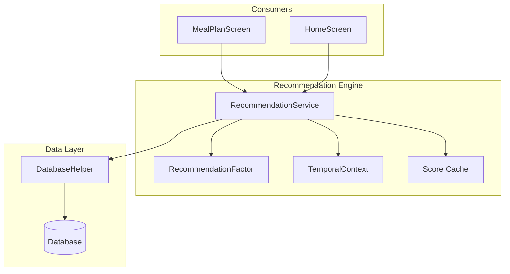
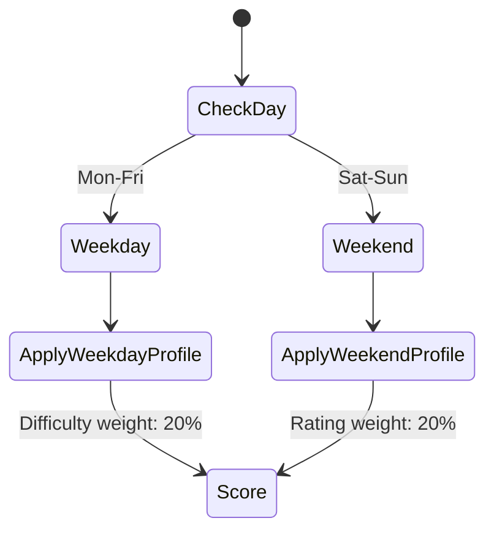

# Example 3: Creating Architecture Documentation

## Scenario

The recommendation engine is a complex component with multi-factor scoring, caching, and temporal context. It currently has no architecture documentation. The developer triggers the Documentation Master to create proper architecture docs.

**Trigger:** "Document the recommendation engine"

**Process:** Specific Documentation Task (3 Checkpoints)

---

## Walkthrough

### CHECKPOINT 1: Plan the Document

```
Documentation Task: Architecture Doc for Recommendation Engine

CHECKPOINT 1: Plan the Document
───────────────────────────────────────────────

Researching the recommendation engine...

Analyzed files:
- lib/core/services/recommendation_service.dart
- lib/core/models/recommendation_factor.dart
- lib/core/models/temporal_context.dart
- test/services/recommendation_service_test.dart
- CLAUDE.md (recommendation sections)

Document Type: Architecture Documentation
Template: architecture_doc_template.md
Location: docs/architecture/recommendation-engine.md

Proposed Outline:

1. Purpose
   - What the recommendation engine does
   - Why multi-factor scoring (not simple random)

2. Architecture Overview
   - Component diagram showing RecommendationService and dependencies
   - How it fits into the broader system

3. Scoring System
   - Factor descriptions (rating, variety, difficulty, temporal)
   - Weight distributions
   - Score calculation formula
   - Normalization approach

4. Temporal Context
   - Weekday profile (difficulty emphasis)
   - Weekend profile (rating/variety emphasis)
   - How context affects weights

5. Caching Strategy
   - Cache key composition
   - Invalidation triggers
   - Performance characteristics

6. Public API
   - getRecommendations() method
   - Parameters and options
   - Return type

7. Configuration
   - Weight profiles
   - Factor configuration

8. Testing
   - How to test individual factors
   - How to test combined scoring
   - Mock setup

9. Diagrams
   - Scoring flow diagram
   - Component diagram
   - Cache invalidation sequence

Cross-references needed:
- Link from Codebase-Overview.md
- Link from CLAUDE.md recommendations section
- Reference in getting-started guide (when created)

Document outline ready. Proceed with draft? (y/n/adjust outline)
```

**User:** y, looks comprehensive

---

### CHECKPOINT 2: Draft the Content

```
───────────────────────────────────────────────
CHECKPOINT 2: Draft the Content

Drafting docs/architecture/recommendation-engine.md...

```markdown
# Recommendation Engine

## Purpose

The recommendation engine suggests recipes to users based on multiple
contextual factors. Rather than simple random selection, it uses a
multi-factor scoring system that considers recipe quality, user variety,
preparation complexity, and temporal context to provide relevant,
diverse recommendations.

## Architecture Overview



The `RecommendationService` is the primary entry point, accessed via
`ServiceProvider.recommendations.service`. It coordinates scoring
factors, applies temporal context, manages caching, and returns
ranked recipe recommendations.

## Scoring System

### Factors

The engine evaluates recipes across four independent factors:

| Factor | What It Measures | Range | Higher = Better |
|--------|-----------------|-------|-----------------|
| Rating | Recipe quality score | 0.0 - 1.0 | Yes |
| Variety | Days since last cooked | 0.0 - 1.0 | Yes |
| Difficulty | Preparation complexity | 0.0 - 1.0 | Context-dependent |
| Temporal | Time-of-day relevance | 0.0 - 1.0 | Yes |

### Weight Profiles

Weights determine how much each factor influences the final score.
They change based on temporal context:

**Weekday Profile** (emphasizes simplicity):
| Factor | Weight | Rationale |
|--------|--------|-----------|
| Rating | 15% | Quality still matters |
| Variety | 25% | Avoid repetition |
| Difficulty | 20% | Prefer simpler meals |
| Temporal | 40% | Match meal time |

**Weekend Profile** (allows complexity):
| Factor | Weight | Rationale |
|--------|--------|-----------|
| Rating | 20% | Prioritize favorites |
| Variety | 15% | Can repeat recent favorites |
| Difficulty | 5% | Complexity welcome |
| Temporal | 60% | Match meal time |

### Score Calculation

```
FinalScore = Σ (FactorScore_i × Weight_i) for i in factors

Where each FactorScore is normalized to [0.0, 1.0]
```

### Individual Factor Scoring

**Rating Factor:**
```dart
score = recipe.rating / maxRating  // Normalized to 0-1
```

**Variety Factor:**
```dart
daysSinceLast = today - lastCookedDate
score = min(daysSinceLast / maxDays, 1.0)  // Capped at 1.0
// Never cooked = 1.0 (maximum variety)
```

**Difficulty Factor:**
```dart
// Weekday: prefer easier (invert difficulty)
score = 1.0 - (recipe.difficulty / maxDifficulty)
// Weekend: difficulty is neutral/positive
score = recipe.difficulty / maxDifficulty
```

## Temporal Context

The engine adapts its behavior based on the day of week:



This ensures that weekday meal suggestions favor simpler preparations
while weekend suggestions allow more ambitious cooking.

## Caching Strategy

Recommendations are cached to avoid recalculating scores on every
request. The cache uses context-aware keys:

**Cache Key:** `{date}_{mealType}_{weekday/weekend}`

**Invalidation Triggers:**
- New meal recorded (variety scores change)
- Recipe edited (rating/difficulty may change)
- Day changes (temporal context changes)
- Manual cache clear

## Public API

### `getRecommendations()`

```dart
/// Returns ranked recipe recommendations based on multi-factor scoring.
///
/// [count] limits the number of recommendations returned.
/// [forDate] determines temporal context (weekday vs weekend).
/// [mealType] filters by meal type if specified.
/// [weekdayMeal] explicitly sets weekday profile (overrides date).
Future<List<RecommendedRecipe>> getRecommendations({
  int count = 5,
  DateTime? forDate,
  String? mealType,
  bool? weekdayMeal,
}) async
```

**Usage:**
```dart
final recommendations = await recommendationService.getRecommendations(
  count: 5,
  forDate: DateTime.now(),
  mealType: 'dinner',
  weekdayMeal: true,
);
```

## Testing

### Testing Individual Factors

```dart
// Test that variety factor gives higher score to uncooked recipes
test('variety factor scores never-cooked highest', () {
  final score = varietyFactor.calculate(
    recipe: neverCookedRecipe,
    context: testContext,
  );
  expect(score, equals(1.0));
});
```

### Testing Combined Scoring

```dart
// Test that weekday profile produces simpler recommendations
test('weekday recommendations favor easier recipes', () async {
  final weekdayRecs = await service.getRecommendations(
    weekdayMeal: true,
  );
  final avgDifficulty = weekdayRecs.map((r) => r.difficulty).average;
  expect(avgDifficulty, lessThan(3.0));
});
```

### Mock Setup

```dart
final mockDb = TestSetup.setupMockDatabase();
// Add recipes with varying difficulty and ratings
mockDb.addTestRecipe(easy: true, rating: 4.0);
mockDb.addTestRecipe(easy: false, rating: 5.0);
```

## Related Documentation

- [Codebase Overview](Gastrobrain-Codebase-Overview.md) - System architecture
- [CLAUDE.md](../../CLAUDE.md) - Recommendation usage patterns
```

Draft complete. Review? (y/n/revise section)
```

**User:** Great draft. Can you add a "Known Limitations" section?

```
Adding "Known Limitations" section...

## Known Limitations

- **No user preference learning:** Weights are fixed profiles, not
  personalized to individual cooking patterns
- **No seasonal awareness:** Doesn't consider seasonal ingredients
  or weather-based preferences
- **Cache granularity:** Entire cache invalidates when any meal is
  recorded, even if the new meal doesn't affect most scores
- **No collaborative filtering:** Single-user design, no
  recommendations based on similar users

These are documented for future enhancement consideration.

Section added. Continue to finalize? (y/n)
```

**User:** y

---

### CHECKPOINT 3: Review and Finalize

```
───────────────────────────────────────────────
CHECKPOINT 3: Review and Finalize

Verifying document accuracy...

✓ Code verification:
  - RecommendationService methods match API section
  - Factor names match codebase
  - Weight values match temporal context implementation
  - Cache key pattern matches implementation

✓ Diagram verification:
  - Component diagram reflects actual dependencies
  - State diagram correctly shows weekday/weekend flow

✓ Cross-references:
  - Added link from Gastrobrain-Codebase-Overview.md → this doc
  - CLAUDE.md already references recommendation patterns

✓ Formatting:
  - Follows architecture_doc_template structure
  - Markdown standards applied
  - Code blocks have language identifiers
  - Tables formatted consistently

✓ Completeness:
  - All template sections covered
  - Testing section includes mock setup
  - Known limitations documented
  - Related documentation linked

Saving to: docs/architecture/recommendation-engine.md

───────────────────────────────────────────────

Document Complete! ✓

Summary:
- docs/architecture/recommendation-engine.md created ✓
  - 9 sections covering architecture, scoring, caching, API, testing
  - 2 Mermaid diagrams (component, state)
  - Code examples from actual codebase
  - Known limitations documented
- Cross-reference added from Codebase-Overview.md ✓

Document finalized? (y/n/revise)
```

**User:** y, perfect

---

## Result

After this process:
- **docs/architecture/recommendation-engine.md** created with complete architecture documentation
- **Scoring system fully documented** with factor descriptions, weight profiles, and formulas
- **Temporal context explained** with state diagram
- **Caching strategy documented** with invalidation triggers
- **Public API documented** with usage examples
- **Testing guide included** for individual and combined factor testing
- **Known limitations captured** for future enhancement planning
- **Cross-references added** from related documentation
