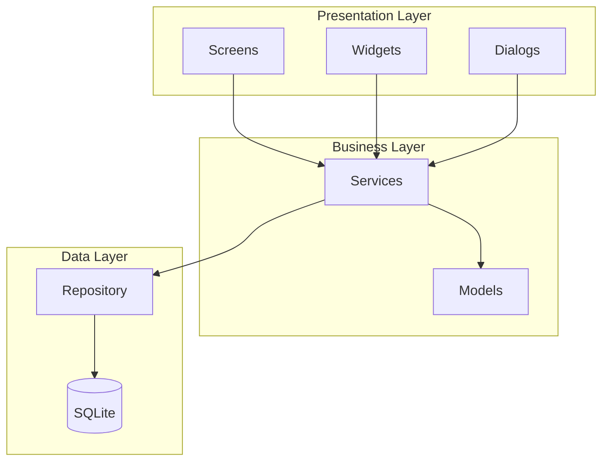
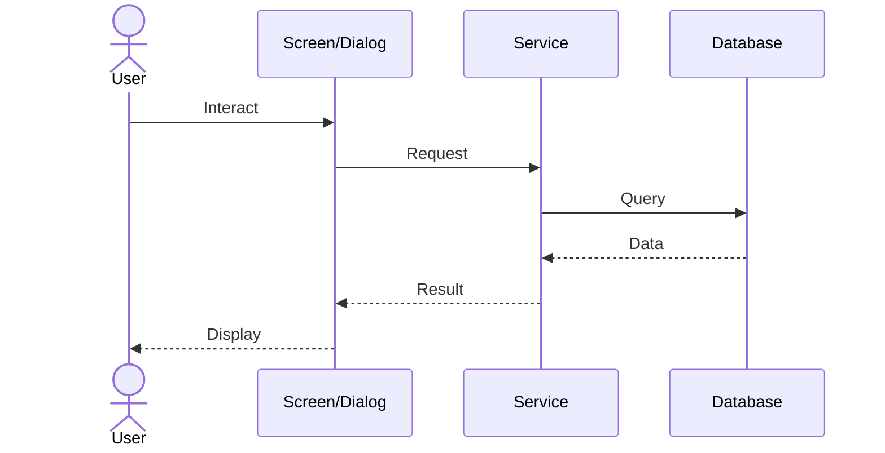
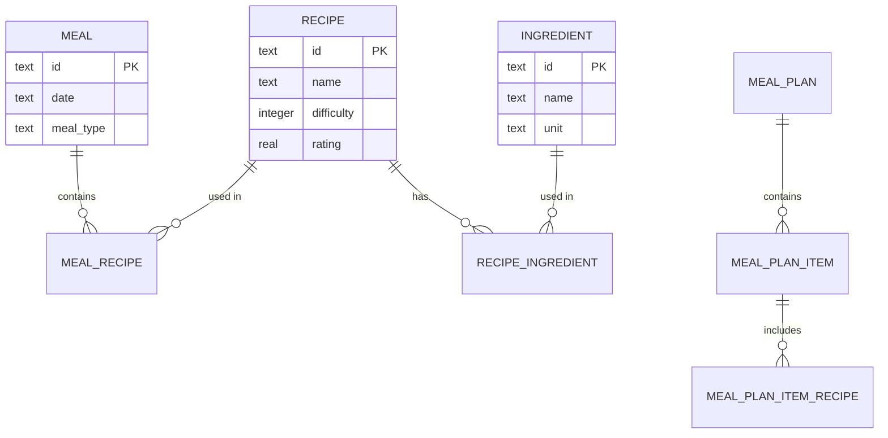
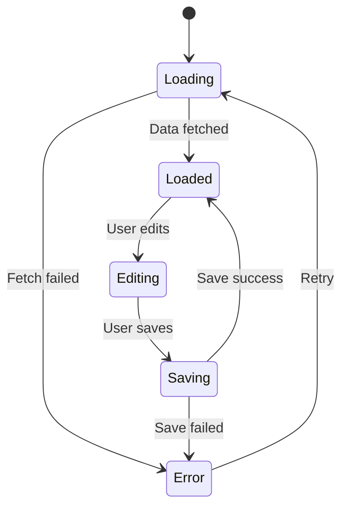
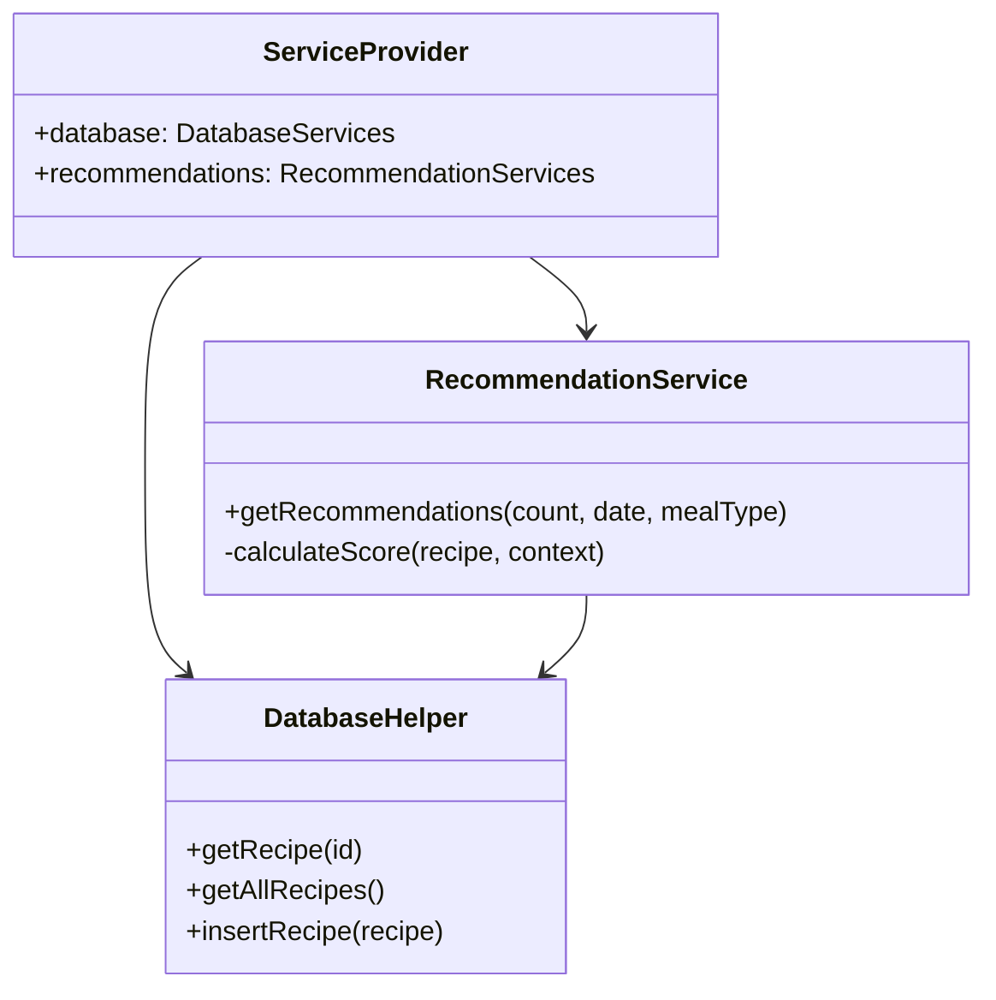
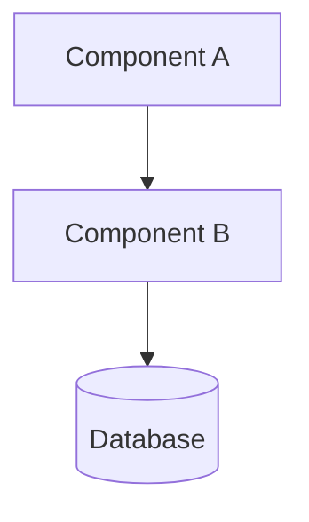
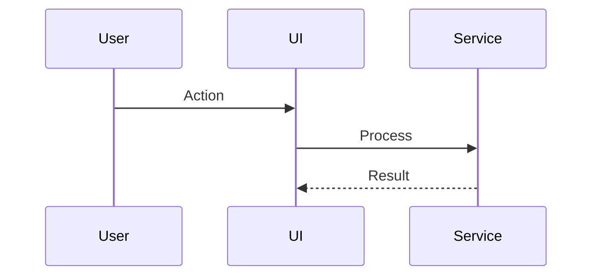
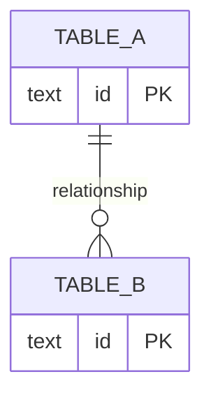

# Diagram Standards

Standards for Mermaid diagrams in Gastrobrain documentation.

---

## When to Use Diagrams

| Situation | Diagram Type | Example |
|-----------|-------------|---------|
| System architecture | `graph TB` / `graph LR` | Component relationships |
| Data flow | `sequenceDiagram` | User action through layers |
| Data models | `erDiagram` | Database tables and relations |
| State machines | `stateDiagram-v2` | Screen states, navigation |
| Class structure | `classDiagram` | Service/model relationships |
| Process flow | `flowchart` | Decision trees, workflows |

**Don't use diagrams for:**
- Simple linear steps (use numbered lists)
- Two-element relationships (describe in text)
- Rapidly changing details (maintenance burden)

---

## Architecture Diagrams

### Component Overview



### Guidelines

- Use `subgraph` to group related components
- Label subgraphs with layer names
- Show direction of dependency (arrows point from dependent to dependency)
- Use standard shapes:
  - `[Rectangle]` for components/classes
  - `[(Database)]` for data stores
  - `([Rounded])` for external systems
  - `{Diamond}` for decisions

---

## Sequence Diagrams

### User Interaction Flow



### Guidelines

- Use `actor` for the user
- Use `participant` with short aliases for components
- Use `->>` for synchronous calls (solid arrow)
- Use `-->>` for responses (dashed arrow)
- Keep to 4-6 participants maximum
- Show the happy path; document error paths in text

---

## Entity-Relationship Diagrams

### Database Schema



### Guidelines

- Use standard relationship notation:
  - `||--||` One to one
  - `||--o{` One to many
  - `o{--o{` Many to many (through junction table)
- Include PK annotation for primary keys
- Show only key columns (not every field)
- Group related entities visually

---

## State Diagrams

### Screen/Feature States



### Guidelines

- Use `[*]` for start/end states
- Label transitions with the trigger/event
- Keep state names short and descriptive
- Show error states and recovery paths

---

## Class Diagrams

### Service Relationships



### Guidelines

- Show only public methods that matter for understanding
- Use `+` for public, `-` for private
- Focus on relationships, not complete class definitions
- Use `-->` for dependency, `--|>` for inheritance

---

## General Diagram Guidelines

### Sizing

- Keep diagrams focused: 5-10 nodes maximum
- If a diagram gets too complex, break into multiple diagrams
- Each diagram should convey one concept

### Naming

- Use short, clear labels (2-3 words max per node)
- Use aliases for long names: `participant Svc as RecommendationService`
- Be consistent with naming across diagrams in the same document

### Color and Style

- Use default Mermaid styling (no custom colors)
- Consistency across all documentation is more important than visual appeal
- Let the structure convey meaning, not colors

### Placement

- Place diagrams after the text that introduces them
- Include a brief caption or explanation before the diagram
- Reference diagrams in text: "As shown in the architecture diagram above..."

### Maintenance

- Update diagrams when architecture changes
- Include diagram source in documentation (not as images)
- Verify diagrams render correctly in GitHub markdown preview

---

## Template Diagram Starters

### Quick Architecture Diagram

````markdown

````

### Quick Sequence Diagram

````markdown

````

### Quick ER Diagram

````markdown

````
