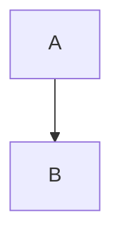

# Markdown Standards

Standards for markdown formatting and structure in Gastrobrain documentation.

---

## General Rules

### Heading Style

- Use ATX-style headers (`#`, `##`, `###`)
- One blank line before and after headers
- Don't skip heading levels (e.g., don't go from `#` to `###`)
- Maximum heading depth: `####` (avoid `#####` and deeper)
- Use sentence case for headings ("Getting started" not "Getting Started") except for proper nouns and acronyms

### Line Length

- Keep lines under 120 characters where practical
- Allow longer lines for URLs, code snippets, and tables
- Don't break mid-sentence just to meet line length

### Blank Lines

- One blank line before and after headers
- One blank line before and after code blocks
- One blank line before and after lists
- One blank line between list items only if items are multi-line
- No trailing blank lines at end of file

### Trailing Whitespace

- No trailing spaces on any line
- Exception: Two trailing spaces for line breaks (prefer `<br>` instead)

---

## Text Formatting

### Emphasis

| Style | Use For | Example |
|-------|---------|---------|
| **Bold** | Key terms, important warnings | `**Required**` |
| *Italic* | Emphasis, first use of a term | `*nullable*` |
| `Code` | Code references, file paths, commands | `` `flutter test` `` |

### Code References in Text

- File paths: `` `lib/core/models/meal.dart` ``
- Commands: `` `flutter analyze` ``
- Class/method names: `` `DatabaseHelper.getRecipe()` ``
- Variable names: `` `isPrimaryDish` ``
- Values: `` `null` ``, `` `true` ``, `` `false` ``

### Lists

**Unordered lists** - Use `-` (dash), not `*` or `+`:
```markdown
- Item 1
- Item 2
- Item 3
```

**Ordered lists** - Use sequential numbers:
```markdown
1. First step
2. Second step
3. Third step
```

**Task lists** - For actionable items:
```markdown
- [ ] Incomplete task
- [x] Completed task
```

**Nested lists** - Indent with 2 spaces:
```markdown
- Parent item
  - Child item
  - Child item
- Another parent
```

---

## Code Blocks

### Fenced Code Blocks

Always use triple backticks with a language identifier:

````markdown
```dart
// Dart code here
```

```bash
# Shell commands here
```

```markdown
# Markdown content here
```


````

**Common language identifiers:**
- `dart` - Dart/Flutter code
- `bash` - Shell commands
- `markdown` - Markdown content
- `mermaid` - Diagrams
- `yaml` - Configuration files
- `json` - JSON data
- `sql` - Database queries

### Inline Code

Use single backticks for inline references:
```markdown
Use `ServiceProvider.database.helper` to access the database.
```

---

## Tables

### Standard Format

```markdown
| Column 1 | Column 2 | Column 3 |
|----------|----------|----------|
| Data 1   | Data 2   | Data 3   |
| Data 4   | Data 5   | Data 6   |
```

### Alignment

```markdown
| Left     | Center   | Right    |
|:---------|:--------:|---------:|
| text     | text     | text     |
```

### Guidelines

- Use tables for structured comparisons and reference data
- Keep tables readable (avoid very wide tables)
- Align pipes vertically for readability in source
- Use inline code for technical values in tables

---

## Links

### Internal Links (Relative)

```markdown
See [Architecture Overview](docs/architecture/overview.md)
See [Issue Workflow](docs/workflows/ISSUE_WORKFLOW.md)
```

- Always use relative paths for internal links
- Use forward slashes even on Windows
- Link to specific sections: `[Section](file.md#section-heading)`

### External Links

```markdown
See the [Flutter documentation](https://flutter.dev/docs)
```

### Link Verification

- All internal links must be verified when documentation changes
- Broken link detection should be part of the documentation audit

---

## Document Structure

### Standard Document Layout

```markdown
# Document Title

[Brief introduction - 1-2 sentences explaining what this document covers]

## Table of Contents (optional, for long documents)

- [Section 1](#section-1)
- [Section 2](#section-2)

## Section 1

[Content]

### Subsection 1.1

[Content]

## Section 2

[Content]

---

## References

- [Related Document 1](path)
- [Related Document 2](path)
```

### When to Include Table of Contents

- Documents longer than 5 major sections
- Reference documents (standards, guides)
- Architecture documentation
- NOT for short guides or READMEs

---

## Special Elements

### Admonitions (Callouts)

Use blockquotes with bold labels:

```markdown
> **Note:** This is an informational callout.

> **Warning:** This is a warning callout.

> **Important:** This is a critical callout.
```

### Horizontal Rules

Use three dashes for section separators:
```markdown
---
```

Only use between major logical sections, not between every heading.

### Status Indicators (in Skill Docs)

Use these consistently across skill documentation:

```markdown
✓ PASS - Checkpoint passed
⚠ WARNING - Minor issues, can proceed
✗ FAIL - Blocking issues
ℹ INFO - Informational note
```

---

## File Naming

| Documentation Type | Convention | Example |
|-------------------|------------|---------|
| Architecture docs | PascalCase or kebab-case | `Gastrobrain-Codebase-Overview.md` |
| Workflow docs | UPPER_SNAKE_CASE | `ISSUE_WORKFLOW.md` |
| Guides | kebab-case | `getting-started.md` |
| ADRs | ADR-NNN-kebab-case | `ADR-001-meal-type-enum.md` |
| Templates | snake_case | `feature_guide_template.md` |
| Standards | snake_case | `code_documentation_standards.md` |

---

## Anti-Patterns

### Avoid

- HTML in markdown (use markdown syntax instead)
- Deeply nested headings (`#####`, `######`)
- Inconsistent list markers (mixing `-`, `*`, `+`)
- Orphaned links (links to nowhere)
- Duplicate information (link instead of copy)
- Overly long paragraphs (break into shorter ones)
- Screenshots without alt text
- Empty sections (remove or mark as TODO)
