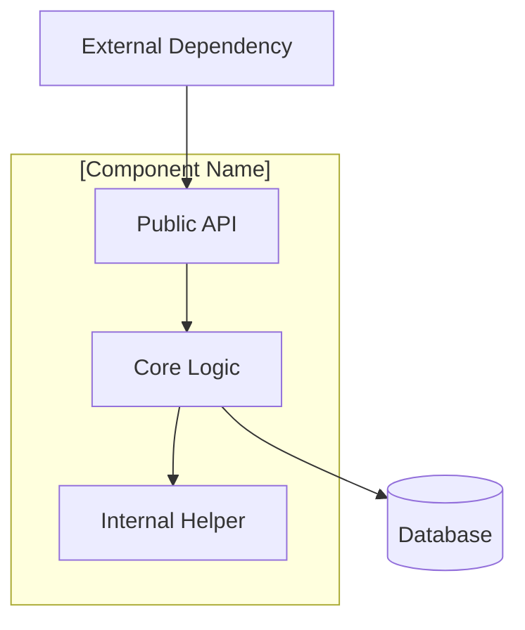

# Architecture Documentation Template

Use this template when documenting a component, service, or architectural layer.

**Location:** `docs/architecture/[component-name].md`

---

## Template

```markdown
# [Component/Service Name]

## Purpose

[Why this component exists. What problem does it solve? 2-3 sentences.]

## Responsibilities

- [Responsibility 1 - what this component owns]
- [Responsibility 2]
- [Responsibility 3]

**Not responsible for:**
- [Explicitly state what this component does NOT do, to prevent scope creep]

## Architecture

[High-level description of how this component fits into the system.]



## Dependencies

### Depends On

| Dependency | Purpose | How Used |
|------------|---------|----------|
| [Service/Class] | [Why needed] | [Injected via ServiceProvider / Direct import] |
| [Database] | [Data persistence] | [Via DatabaseHelper] |

### Depended On By

| Consumer | How Used |
|----------|----------|
| [Screen/Widget] | [Calls method X for Y] |
| [Other Service] | [Uses for Z] |

## Public API

### Key Methods

#### `methodName(param1, param2)`

[Description of what this method does.]

**Parameters:**
- `param1` (`Type`) - [Description]
- `param2` (`Type?`) - [Description, nullable because...]

**Returns:** `ReturnType` - [Description]

**Throws:**
- `NotFoundException` - when [condition]
- `ValidationException` - when [condition]

**Example:**
```dart
final result = await service.methodName(
  param1: value,
  param2: optionalValue,
);
```

#### `anotherMethod()`

[Repeat pattern for each public method]

## Data Model

[If this component owns data models]

```dart
/// [Brief description]
class ModelName {
  final String id;
  final String name;
  // ... key fields with comments
}
```

### Database Schema

| Column | Type | Nullable | Description |
|--------|------|----------|-------------|
| `id` | TEXT | No | Primary key |
| `name` | TEXT | No | Display name |
| [etc.] | | | |

## Design Patterns

### [Pattern Name]

[Describe the design pattern used and why.]

```dart
// Code showing the pattern in use
```

**Why this pattern:**
- [Reason 1]
- [Reason 2]

## Configuration

[If the component has configurable behavior]

| Setting | Default | Description |
|---------|---------|-------------|
| [Setting] | [Value] | [What it controls] |

## Error Handling

[How this component handles and reports errors]

```dart
try {
  // operation
} on NotFoundException {
  // Handle not found - [what happens]
} on ValidationException {
  // Handle validation - [what happens]
} on GastrobrainException {
  // Handle general error - [what happens]
}
```

## Performance Considerations

- [Caching strategy, if any]
- [Bulk operation support]
- [Known performance characteristics]

## Testing

### Unit Tests

- Location: `test/[path]/`
- Mock: `MockDatabaseHelper` for database isolation
- Key scenarios: [list what's tested]

### Integration Tests

- Location: `test/integration/[path]/`
- Uses real database
- Key scenarios: [list what's tested]

## Related Documentation

- [Link to related architecture doc]
- [Link to related guide]
- [Link to ADR if decision documented]

## Version History

| Date | Change | Issue |
|------|--------|-------|
| YYYY-MM-DD | Initial implementation | #XXX |
| YYYY-MM-DD | Added [feature] | #YYY |
```

---

## Usage Notes

- Focus on the "why" not just the "what"
- Include actual code examples from the codebase
- Keep the Public API section current with actual method signatures
- The Mermaid diagram should show how the component relates to others
- Update the Version History when significant changes are made
- Cross-reference related documentation
