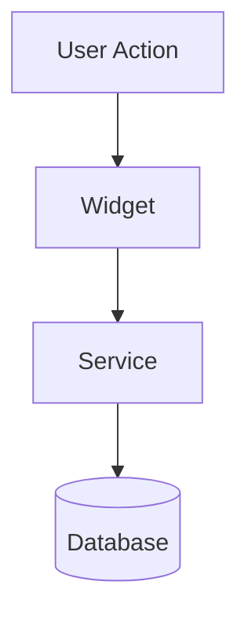

# Feature Guide Template

Use this template when documenting a new feature or significant enhancement.

**Location:** `docs/guides/[feature-name].md`

---

## Template

```markdown
# [Feature Name]

## Overview

[Brief description - what this feature does and why it exists. 2-3 sentences.]

## User Perspective

### How to Use

1. [Step 1 - describe the action]
2. [Step 2 - describe the action]
3. [Step 3 - describe the action]

### Available Options

| Option | Description | Default |
|--------|-------------|---------|
| [Option 1] | [What it does] | [Default value] |
| [Option 2] | [What it does] | [Default value] |

### Tips

- [Tip 1 - helpful usage guidance]
- [Tip 2 - common workflow improvement]
- [Tip 3 - things users might not discover on their own]

## Developer Perspective

### Architecture

[How this feature works technically. Include a Mermaid diagram if helpful.]



### Key Components

| Component | Location | Purpose |
|-----------|----------|---------|
| [Widget/Class] | `lib/[path]` | [What it does] |
| [Service] | `lib/[path]` | [What it does] |
| [Model] | `lib/[path]` | [What it does] |

### Data Model

[Describe the data model used by this feature]

```dart
// Key fields and their purposes
class [ModelName] {
  final String id;           // [Purpose]
  final String name;         // [Purpose]
  final [Type]? optionalField; // [Purpose, nullable because...]
}
```

### Database

[If this feature involves database changes]

- **Table:** `[table_name]`
- **Migration:** v[XX]
- **Key columns:** [list columns and types]
- **Backward compatible:** [Yes/No]

### Localization

[If this feature has localized strings]

- **English keys:** `app_en.arb` - [list key names]
- **Portuguese keys:** `app_pt.arb` - [list key names]

### Code Example

```dart
// Complete usage example showing how to interact with this feature
// programmatically (for developers building on top of it)
```

### Testing

[How to test this feature]

- **Unit tests:** `test/[path]`
- **Widget tests:** `test/[path]`
- **Edge cases:** `test/edge_cases/[path]`

### Known Limitations

- [Limitation 1]
- [Limitation 2]

### Related Issues

- #[XXX]: [Issue that created this feature]
- #[YYY]: [Related follow-up issue]
```

---

## Usage Notes

- Replace all `[placeholders]` with actual content
- Remove sections that don't apply (e.g., Database if no DB changes)
- Keep the User Perspective section non-technical
- Keep the Developer Perspective section technical and specific
- Include actual file paths, not generic ones
- Include actual code examples from the codebase
- Link to related documentation
