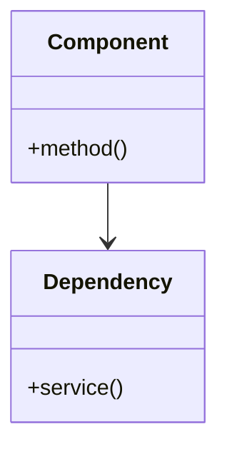

# Pattern Documentation Template

Use this template when capturing a reusable design pattern used in the codebase.

**Location:** `docs/patterns/[pattern-name].md`

---

## Template

```markdown
# [Pattern Name] Pattern

## When to Use

[Describe the situations where this pattern applies.]

- [Situation 1 - when you encounter X]
- [Situation 2 - when you need Y]
- [Situation 3 - when building Z]

## When NOT to Use

- [Anti-pattern situation 1]
- [Anti-pattern situation 2]

## Structure

[Describe how to structure code following this pattern.]



## Implementation

### Step 1: [First step]

```dart
// Code showing the first step
```

### Step 2: [Second step]

```dart
// Code showing the second step
```

### Step 3: [Third step]

```dart
// Code showing the third step
```

## Complete Example

```dart
// Full working example combining all steps
// Use actual code from the codebase when possible
```

## Benefits

- [Benefit 1 - what problem it solves]
- [Benefit 2 - what quality it improves]
- [Benefit 3 - what maintenance advantage]

## Trade-offs

- [Trade-off 1 - what complexity it adds]
- [Trade-off 2 - what limitation exists]

## Variations

### [Variation Name]

[When to use this variation instead of the standard pattern.]

```dart
// Code showing the variation
```

## Examples in Codebase

| File | Usage | Notes |
|------|-------|-------|
| `lib/[path/file.dart]` | [How pattern is used here] | [Any special notes] |
| `lib/[path/file.dart]` | [How pattern is used here] | [Any special notes] |
| `lib/[path/file.dart]` | [How pattern is used here] | [Any special notes] |

## Testing This Pattern

[How to test code that follows this pattern.]

```dart
// Test example showing how to test the pattern
```

## Common Mistakes

| Mistake | Why It's Wrong | Correct Approach |
|---------|---------------|------------------|
| [Common mistake 1] | [Explanation] | [Fix] |
| [Common mistake 2] | [Explanation] | [Fix] |

## Related Patterns

- **[Related Pattern 1]** - [How it relates, when to choose one over the other]
- **[Related Pattern 2]** - [How it relates]

## References

- [Link to original pattern description if applicable]
- [Link to related ADR if decision documented]
```

---

## Usage Notes

- Always include real examples from the Gastrobrain codebase
- Keep the "Complete Example" section as a self-contained reference
- The "Common Mistakes" section prevents recurring errors
- Update "Examples in Codebase" as new usages are added
- Cross-reference related patterns to help developers choose
